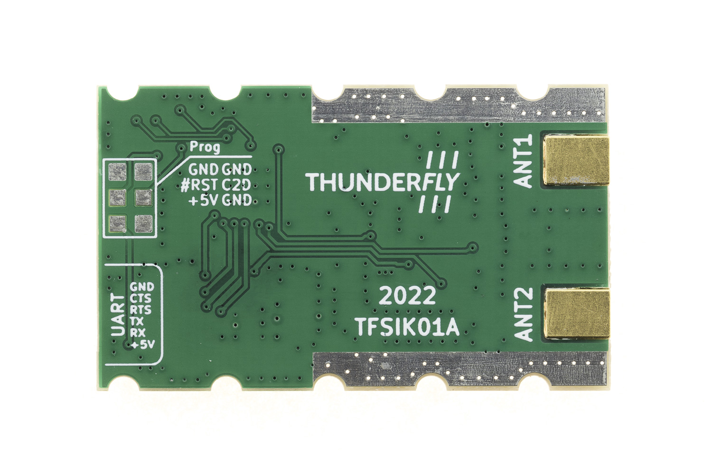
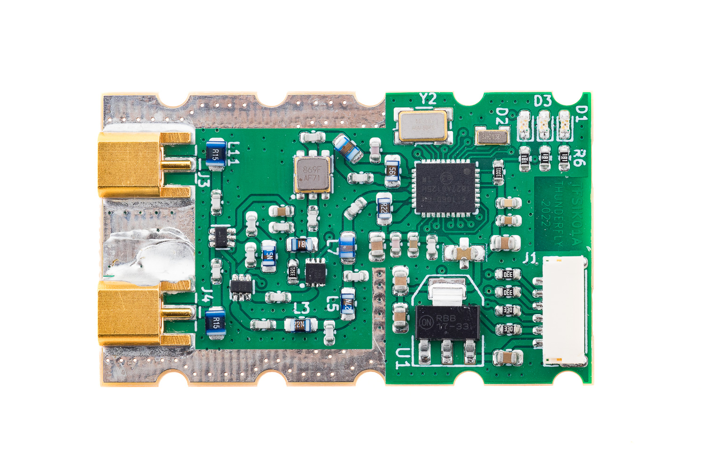

# TFSIK01A - Dual Antenna diversity UAV telemetry modem

The TFSIK01A is probably the first open-source hardware design of a UAV modem with [SiK firmware](https://github.com/ThunderFly-aerospace/SiK). It uses the latest Si1000 series chip Si1060 which is equipped with Si4463 EZRadioPRO Transceiver.

## Hardware

 

## Parameters and features

  * Supported protocol: MAVLink 2
  * Supported bands: 433MHz, 868 MHz.
  * Modem chip: Si4463
    * User-selectable output power up to +20 dBm (The maximum legally allowed power output)
    * RX Sensitivity -124 dBm @ 1000 bps FSK
  * MIMO 2x2 RX/TX: Two antenna diversity
    * Two separated [MCX connectors](https://en.wikipedia.org/wiki/MCX_connector) RX and TX on the each connector
  * Automatic antenna switching
  * Interface: Pixhawk compatible JST-GH UART link
  * RF switch: SPDT High Power UltraCMOS 10 MHz - 3 GHz
  * RF input amplifier
    * 50MHz to 4000MHz, GaAs pHEMT SPF5189
    * Noise Figure 0.60dB
    * High noise immunity OIP3 39.5dBm
    * Gain 18.7dB
  * Filter: SAW AFS selected for specific ISM band
  * Power: +5V 500 mA.

## Usage 

### UAV command and control

The TFSIK modem is intended to be used at UAV as an "in the air" part of the communication link. For the ground control station, the [TFMODEM](https://github.com/ThunderFly-aerospace/TFMODEM01) is supposed to be used.  
The reasons for the difference in the air and ground control station units are design tradeoffs.  
For the example, the ground control unit needs a very reliable, therefore there is a large interface USB connector, to the ground control station computer. 
The same connector is impractical to be used in the UAV part. The similar restrictions applies to the RF filters, antenna connectors, etc. To resolve that, we decided to use different implementations to the ground station. 

### ROS2 long-range wireless datalink

SiK firmware is commonly used in radio modems, particularly in the fields of unmanned aerial vehicles (UAVs) and robotics. When integrated into Robot Operating System (ROS) or ROS2 environments, SiK technology offers several advantages. It provides reliable and long-range communication, which is crucial for both indoor and outdoor robotic applications. The low latency of TFSIK01 modems ensures real-time responsiveness, a critical factor in robotics. These modems are highly configurable, offering users the flexibility to tailor the system according to specific needs. Additionally, their compatibility with various communication protocols makes them easy to integrate into existing ROS and ROS2 systems. 

## Where I could get it?  

The device can be purchased from [ThunderFly s.r.o.](https://www.thunderfly.cz/). Contact us by email at info@thunderfly.cz for a commercial quotation.
