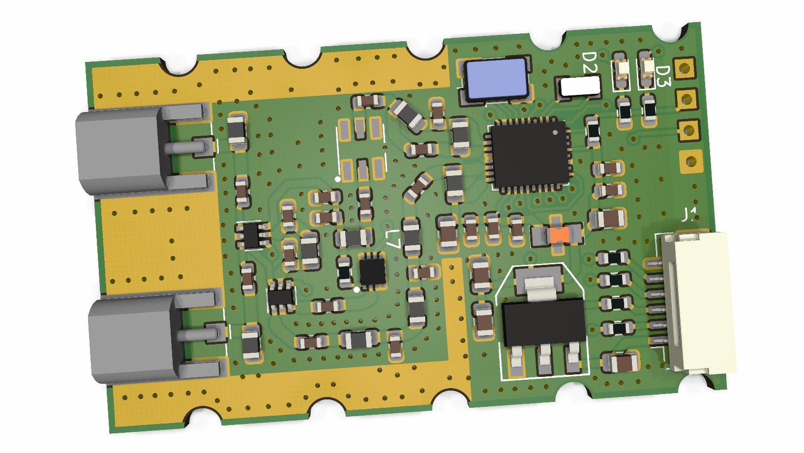

# TFSIK01A - UAV telemetry modem

The TFSIK01A is probably the first open-source hardware design of UAV modem with [SiK firmware](https://github.com/ThunderFly-aerospace/SiK). It uses the latest Si1000 series chip Si1060 which is equipped by Si4463 EZRadioPRO Transceiver.

## Hardware

 

The device can be purchased from [ThunderFly s.r.o.](https://www.thunderfly.cz/). Contact us by email info@thunderfly.cz for a commercial quotation.
