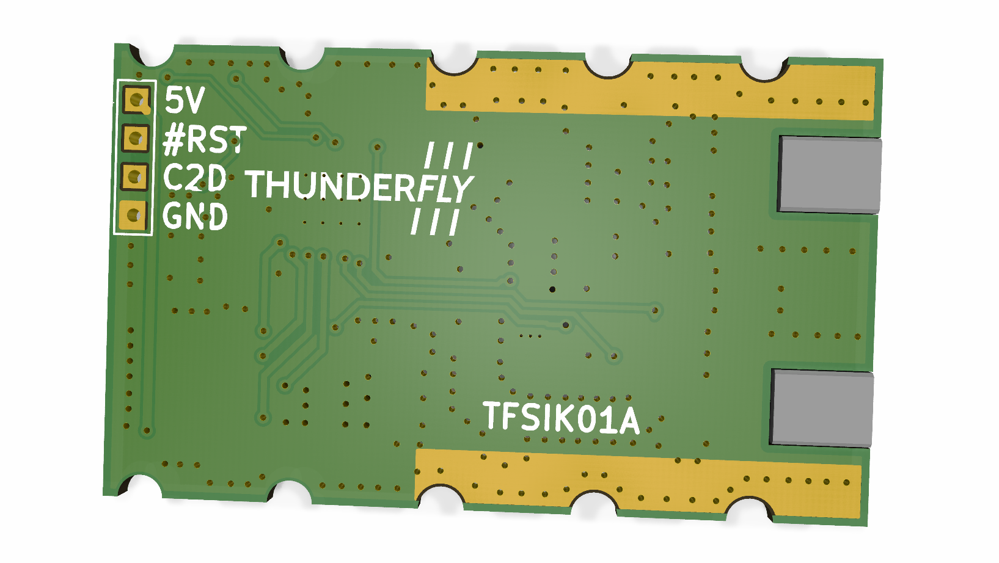

# TFSIK01A - UAV telemetry modem

The TFSIK01A is probably the first open-source hardware design of UAV modem with [SiK firmware](https://github.com/ThunderFly-aerospace/SiK). It uses the latest Si1000 series chip Si1060 which is equipped by Si4463 EZRadioPRO Transceiver.

## Hardware

 

## Parameters and features

  * Supported protocol: MAVLink 2
  * Supported bands: 433MHz, 868 MHz.
  * Modem chip: Si4463
    * User selectable output power up to +20 dBm (The maximum legally allowed power output)
    * RX Sensitivity -124 dBm @ 1000 bps FSK
  * MIMO RX/TX: Two antenna diversity
    * Two separated [MCX connectors](https://en.wikipedia.org/wiki/MCX_connector) RX and TX on the each
  * Automatic antenna switching
  * Interface: Pixhawk compatible JST-GH UART link
  * RF switch: SPDT High Power UltraCMOS 10 MHz - 3 GHz
  * RF input amplifier
    * 50MHz to 4000MHz, GaAs pHEMT SPF5189
    * Noise Figure 0.60dB
    * High noise imunity OIP3 39.5dBm
    * Gain 18.7dB
  * Filter: SAW AFS selected for specific ISM band
  * Power: +5V 500 mA.

## Usage 

The TFSIK modem is intended to be used at UAV as an "in the air" part of the communication link. For the ground control station, the [TFMODEM](https://github.com/ThunderFly-aerospace/TFMODEM01) is supposed to be used.  
The reasons for the difference in the air and ground control station units are design tradeoffs.  For the example of tradeoff the ground control unit needs a very reliable, therefore large interface USB connector, to the ground control station computer. 
The same connector is impractical to be used in the UAV part. The same applies to the RF filters, antenna connectors, etc. To resolve that, we decided to use different implementations to the ground station, although technically both modems could be used on both sides. 

The device can be purchased from [ThunderFly s.r.o.](https://www.thunderfly.cz/). Contact us by email info@thunderfly.cz for a commercial quotation.
